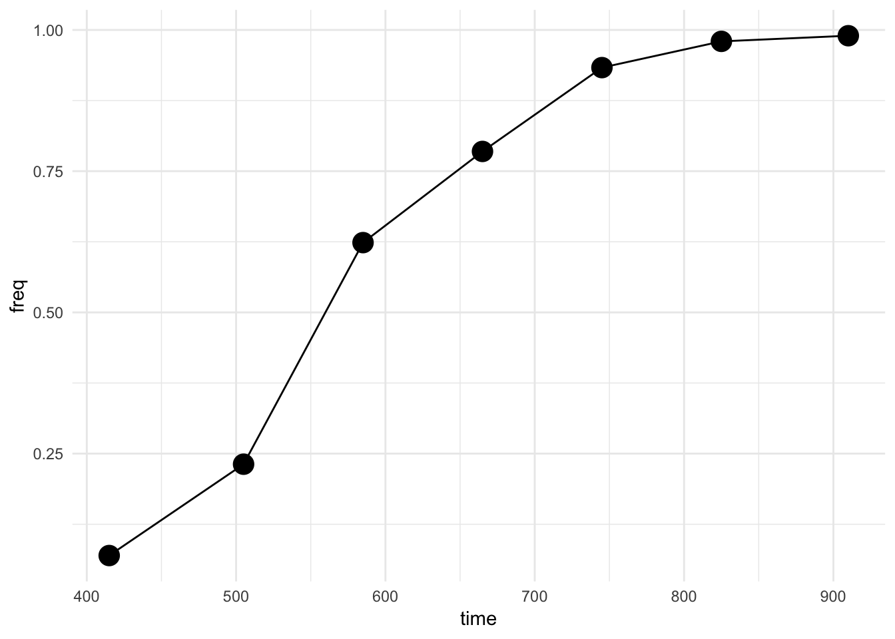
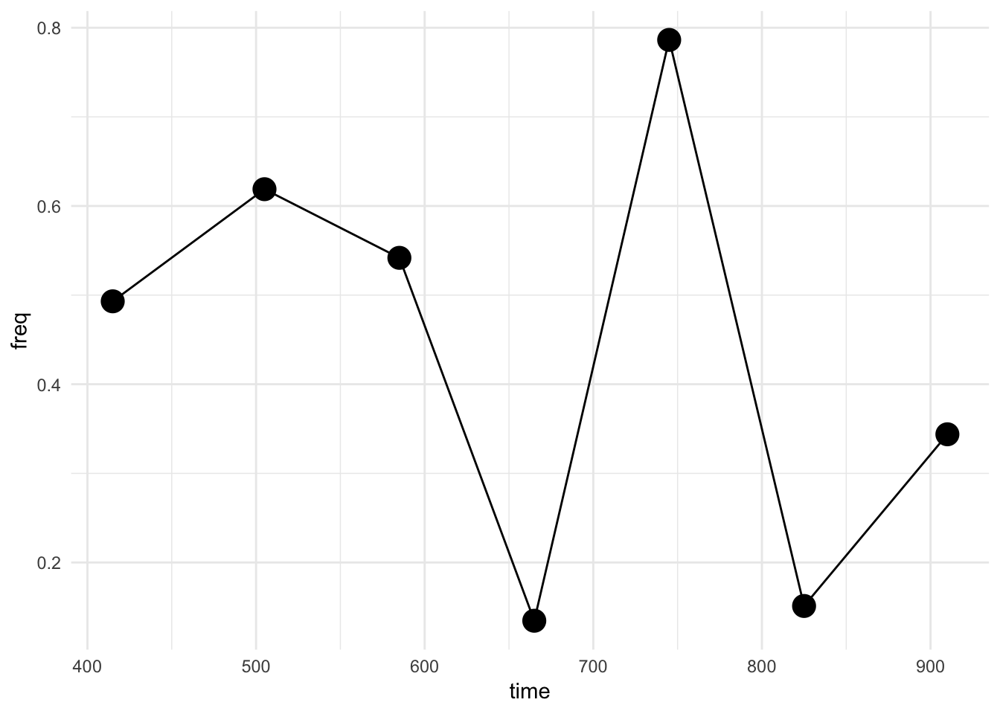
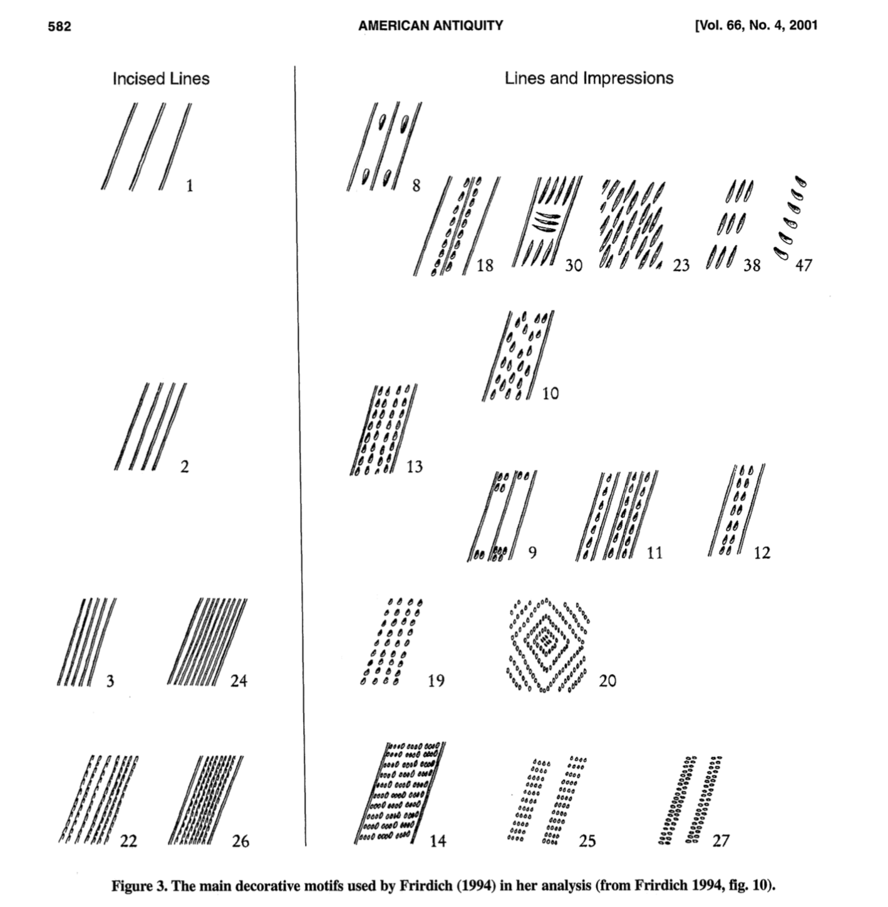
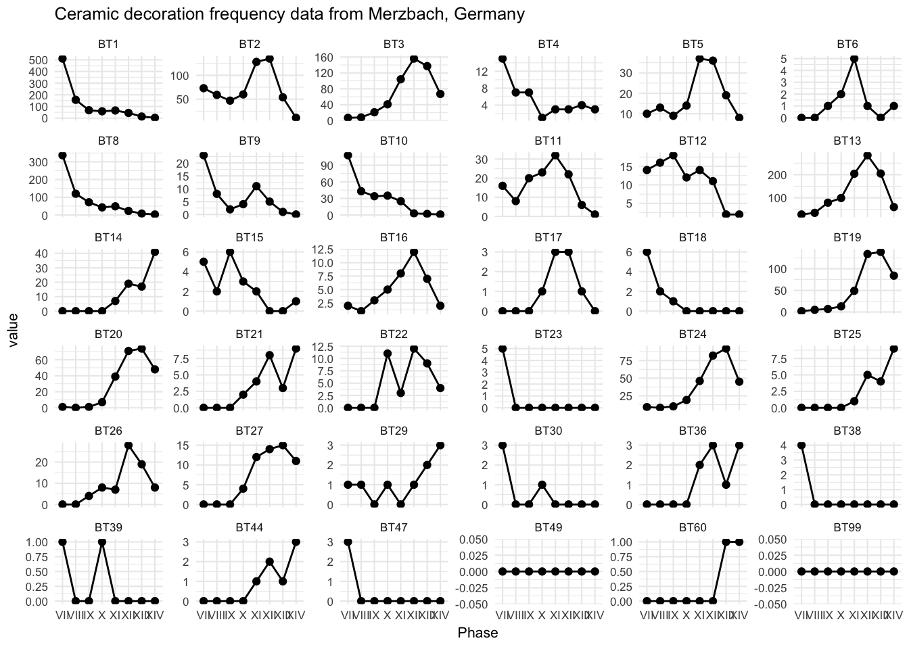
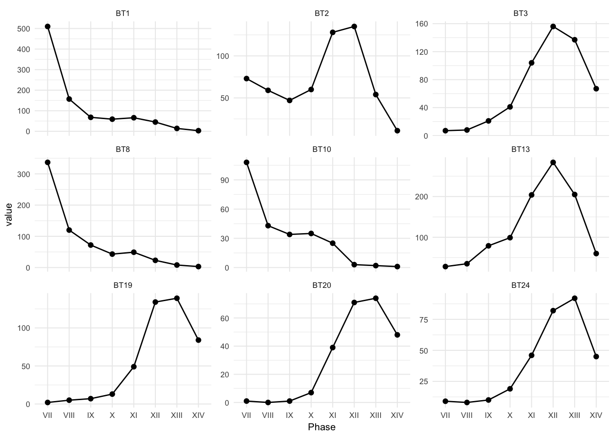
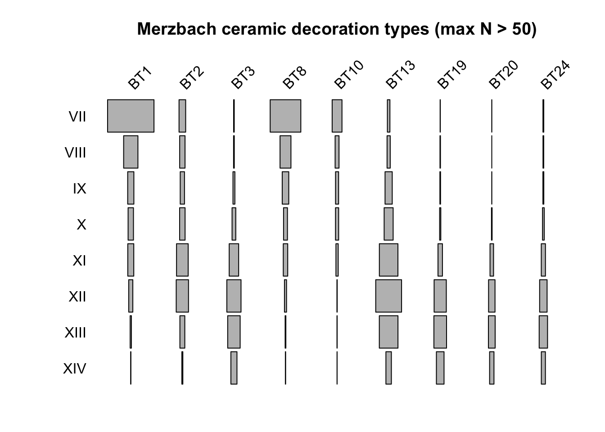
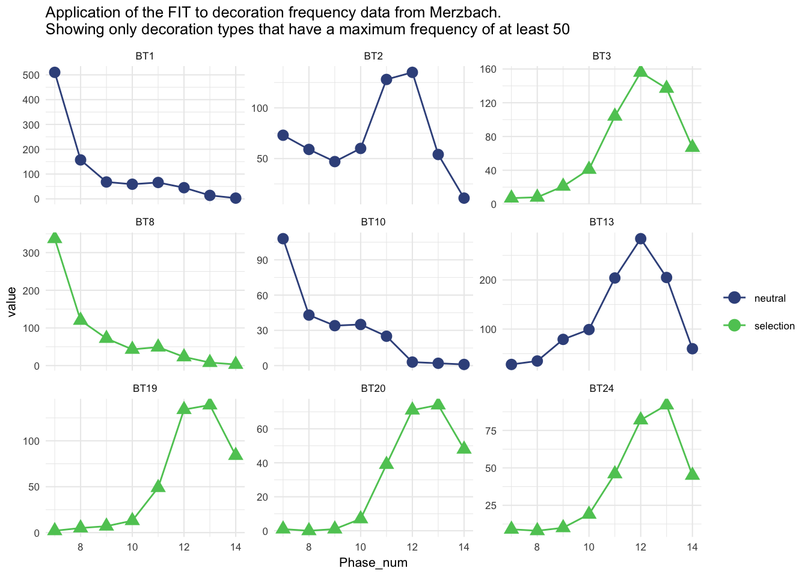
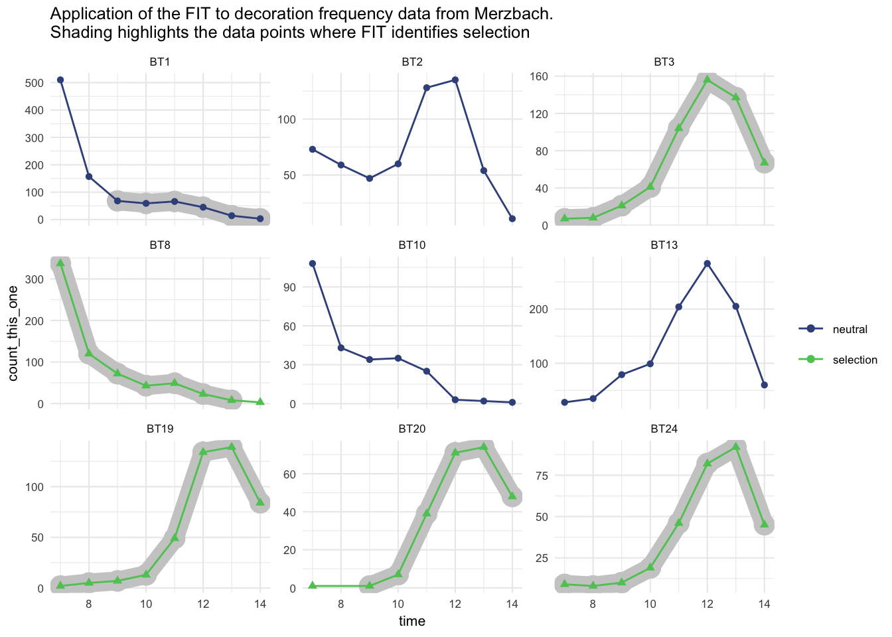
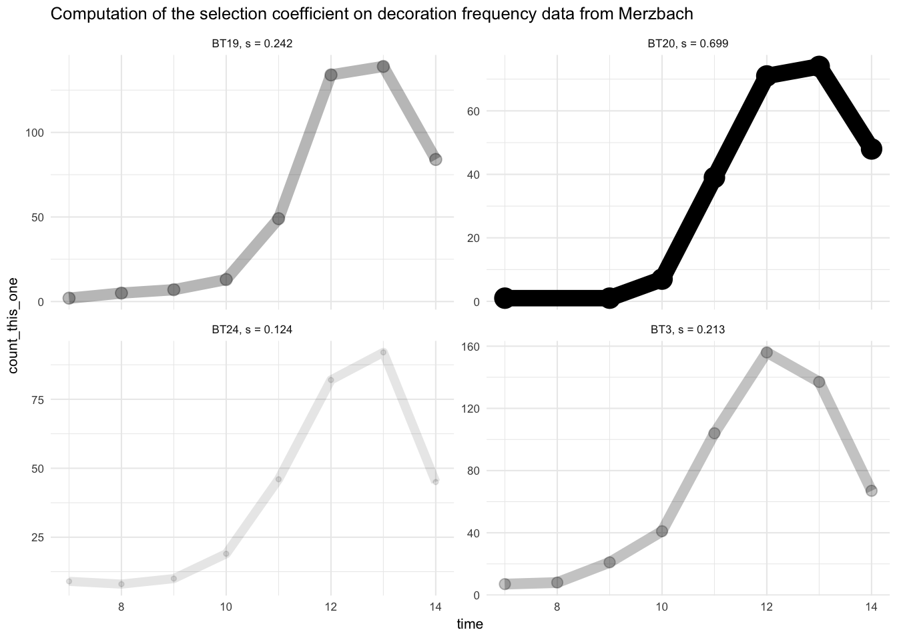

<!-- README.md is generated from README.Rmd. Please edit that file -->
signatselect: Identifying signatures and strengths of selection
===============================================================

[](https://travis-ci.org/benmarwick/signatselect) [](http://beta.mybinder.org/v2/gh/benmarwick/signatselect/master?urlpath=rstudio)

The goal of signatselect is to provide two functions useful for investigating change over time in artefact assemblages (and genetic time-series data):

-   `fit()` the frequency increment test as simple statistical test to aid in the detection and quantification of selective processes in the archaeological record. This is adapted directly from the algorithm published in Feder, A. F., Kryazhimskiy, S., & Plotkin, J. B. (2014). Identifying signatures of selection in genetic time series. *Genetics*, 196(2), 509-522. <https://doi.org/10.1534/genetics.113.158220> and Newberry's implementation of Feder's FIT for R at <https://github.com/mnewberry/ldrift> for their paper Newberry, et al. (2017). Detecting evolutionary forces in language change. *Nature*, 551(7679), 223–226. <https://doi.org/10.1038/nature24455>

-   `tsinfer()` to estimate the population size and the selection coefficient favoring one variant over another from time-series variant-frequency data. This is adapted from Feder et al. (2014) and Hezekiah Akiva Bacovcin's <https://github.com/bacovcin/tsinfer-R>, who adapted it from Sergey Kryazhimskiy's OCaml language version of `tsinfer` at <https://github.com/skryazhi/tsinfer>.

Installation
------------

You can install the development version of signatselect from GitHub with:

``` r
# install.packages("pak")
pak::pkg_install("benmarwick/signatselect")
```

Examples
--------

### The Frequency Increment Test

Here is an example of the `fit()`, the frequency increment test:

``` r
# install.packages("tidyverse")
suppressPackageStartupMessages(library(tidyverse))

  # data slightly modified from Feder et al. Table S2 
  feder_table_2 <- 
  tibble(time = c(415 , 505 , 585 , 665 , 745 , 825 , 910),
         freq = c(0.06956522, 0.23125000, 0.62352941, 0.78494624, 0.93333333, 0.97979798, 0.98979592))
```

Let's take a look:

``` r
  ggplot(feder_table_2,
         aes(time, freq)) +
  geom_line() +
  geom_point(size = 5) +
  theme_minimal()
```



There's a trend of increasing frequencies, but is it a result of selection? Let's see:

``` r
library(signatselect)

    fit(
      time = feder_table_2$time,
      v = feder_table_2$freq
    )
#>   fit_stat      fit_p
#> 1 3.262457 0.02238466
```

The result of the FIT, with the low p-value, indicates that selection is occuring in this time series.

How about the null situation, can we credibly detect a situation with no selection? Here's a random uniform distribution of a variant:

``` r
  no_selection <- 
  tibble(time = c(415 , 505 , 585 , 665 , 745 , 825 , 910),
         freq = runif(7))

  ggplot(no_selection,
         aes(time, freq)) +
  geom_line() +
  geom_point(size = 5) +
  theme_minimal()
```



``` r
    fit(
      time = no_selection$time,
      v = no_selection$freq
    )
#>     fit_stat     fit_p
#> 1 0.04908068 0.9627552
```

And we see a high p-value, indicating no selection in this time series.

### Infer population size and selection coefficient from time-series variant-frequency data

Here is an example of `tsinfer()` to estimate the population size and the selection coefficient favoring one variant over another from time-series variant-frequency data. Here's some sample data:

-   `tvec` contains sample times
-   `bvec` contains the number of samples of the focal variant (must be integers) and,
-   `nvec` containes total number of samples at each time point (must be integers)

``` r
  # data adapted from https://github.com/skryazhi/tsinfer
  tvec = c(0, 10, 20)
  bvec = c(2000, 4000, 6000)
  nvec = c(10000, 10000, 10000)
```

Now we compute the test result:

``` r
  tsinfer_output <- 
  tsinfer(
    tvec = tvec,
    bvec = bvec,
    nvec = nvec,
    verbose = FALSE
  )

# and take a look at the result 
tsinfer_output
#> $s.0
#> [1] 0
#> 
#> $alpha.0
#> [1] 80.02608
#> 
#> $f0.0
#> [1] 0.2
#> 
#> $LL.0
#> [1] 18.04008
#> 
#> $s
#> [1] 0.08925489
#> 
#> $alpha
#> [1] 16436.47
#> 
#> $f0
#> [1] 0.3659511
#> 
#> $LL
#> [1] 13.408
```

The selection coefficient for non-neutral model is in `s`, and so the value here is 0.089. The population size for non-neutral model is in `alpha`, and here is 1.643647410^{4}

An archaeological application
-----------------------------

### The frequency increment test

Here is an example of using the FIT to identify pottery types that indicate selection. We are using frequencies of different decorative motifs in the Merzbach assemblage, Neolithic Germany (Crema et al. 2016; many other papers). We can load the data from the `evoarchdata` package on GitHub:

``` r
# pak::pkg_install("benmarwick/evoarchdata")
library(evoarchdata)
data("ceramics_lbk_merzbach")

# take a look
ceramics_lbk_merzbach
#> # A tibble: 8 x 37
#>   Phase  BT14  BT25  BT60  BT21  BT36  BT44  BT20  BT22  BT19  BT27  BT29
#>   <chr> <dbl> <dbl> <dbl> <dbl> <dbl> <dbl> <dbl> <dbl> <dbl> <dbl> <dbl>
#> 1 VII       0     0     0     0     0     0     1     0     2     0     1
#> 2 VIII      0     0     0     0     0     0     0     0     5     0     1
#> 3 IX        0     0     0     0     0     0     1     0     7     0     0
#> 4 X         0     0     0     2     0     0     7    11    13     4     1
#> 5 XI        7     1     0     4     2     1    39     3    49    12     0
#> 6 XII      19     5     0     8     3     2    71    12   134    14     1
#> 7 XIII     17     4     1     3     1     1    74     9   139    15     2
#> 8 XIV      41     9     1     9     3     3    48     4    84    11     3
#> # … with 25 more variables: BT24 <dbl>, BT26 <dbl>, BT6 <dbl>, BT3 <dbl>,
#> #   BT17 <dbl>, BT13 <dbl>, BT16 <dbl>, BT5 <dbl>, BT2 <dbl>, BT11 <dbl>,
#> #   BT99 <dbl>, BT49 <dbl>, BT12 <dbl>, BT4 <dbl>, BT15 <dbl>, BT9 <dbl>,
#> #   BT39 <dbl>, BT10 <dbl>, BT8 <dbl>, BT1 <dbl>, BT30 <dbl>, BT18 <dbl>,
#> #   BT47 <dbl>, BT38 <dbl>, BT23 <dbl>
```

Here's a sample of some of the pottery decorations, from [Shennan and Wilkinson (2001)](https://www.jstor.org/stable/2694174):



Here's an overview of how each motif changes over time in this assemblage:

``` r
# get ordered factor of decoration types so we can order the plots nicely 

decoration_types <- 
names(ceramics_lbk_merzbach)[-1] %>%
  enframe() %>% 
  separate(value, into = c('a', 'b'), 2) %>% 
  mutate(b = parse_number(b)) %>% 
  arrange(b) %>% 
  unite(decorations, c(a,b), sep = "") %>% 
  pull(decorations)

# see how the freqs of each change over time
ceramics_lbk_merzbach_long <-
  ceramics_lbk_merzbach %>%
  gather(variable, value, -Phase) %>% 
  mutate(Phase = fct_relevel(Phase, ceramics_lbk_merzbach$Phase)) %>% 
  mutate(variable = fct_relevel(variable, decoration_types))

# plot
ggplot(ceramics_lbk_merzbach_long,
       aes(Phase,
           value)) +
  geom_line(aes(group = 1)) +
  geom_point() +
  facet_wrap(~variable,
             scales = "free_y") +
  theme_minimal(base_size = 8) +
  ggtitle(str_glue('Ceramic decoration frequency data from Merzbach, Germany'))
```



There are many decoration types, so let's narrow it down to ones that have a maximum frequency of at least 50.

``` r
ceramics_lbk_merzbach_long_subset <-
  ceramics_lbk_merzbach_long %>% 
  group_by(variable) %>% 
  filter(max(value) > max_n)

# keep these decorations
decorations_to_keep <- unique(as.character(ceramics_lbk_merzbach_long_subset$variable))

# plot
ggplot(ceramics_lbk_merzbach_long_subset,
       aes(Phase,
           value)) +
  geom_line(aes(group = 1)) +
  geom_point() +
  facet_wrap(~variable,
             scales = "free_y") +
  theme_minimal(base_size = 8)
```



We can also view these in the classic archaeological visualiation, the battleship plot:

``` r
phases <-  unique(ceramics_lbk_merzbach_long_subset$Phase)

library(plotrix)

ceramics_lbk_merzbach_matrix <- 
ceramics_lbk_merzbach_long_subset %>% 
  spread(variable, value) %>% 
  select(-Phase) %>% 
  as.matrix() 

row.names(ceramics_lbk_merzbach_matrix) <- phases

battleship.plot(ceramics_lbk_merzbach_matrix,
                yaxlab = phases,
                col = "grey",
                main=str_glue("Merzbach ceramic decoration types (max N > {max_n})"))
```



To prepare the data for the FIT we need to reshape it to a long form, compute frequency as ratio of count of type of a interest to all other types, and drop decoration types with less than threee time points (we need a min of three time points to compute the FIT).

``` r
# reshape data for each decoration type to go into test:
ceramics_lbk_merzbach_prop <- 
  ceramics_lbk_merzbach %>% 
  select(Phase, decorations_to_keep)

df <- ceramics_lbk_merzbach_prop[ , 2:ncol(ceramics_lbk_merzbach_prop)]
time <- utils:::.roman2numeric(ceramics_lbk_merzbach_prop$Phase)

# compute frequency as ratio of count of type of interest to all other types
list_of_dfs <- vector("list", ncol(df))
names(list_of_dfs) <- names(df)

for(i in 1:ncol(df)){
  tmp <-
    data.frame(time = time,
               count_this_one = df[[i]],
               count_others = rowSums(df[, (seq_len(ncol(df)))[-i]   ]))
  
  # compute frequency
  tmp$frequency = with(tmp, count_this_one / count_others)
  
  # collect results and exclude rows with zero counts for this type i
  list_of_dfs[[i]] <- tmp[which(tmp$count_this_one != 0 ), ]
}

# we need a min of three time points to compute the FIT, so drop decoration types with less than 3
list_of_dfs_three_or_more <- 
  keep(list_of_dfs, ~nrow(.x) >= 3)
```

We can prepare safe version of the FIT so we can use it in loops without breaking out of the loop when there is an error for one iteration

``` r
fit_safely <- 
  safely(fit, 
         otherwise = data.frame(fit_stat = NA,
                                fit_p = NA))
```

Now we can compute the FIT for each pottery decoration type:

``` r
# apply test to each decoration type
df_fit_test_results <-
  list_of_dfs_three_or_more %>%
  bind_rows(.id = "type") %>%
  nest(-type) %>%
  mutate(fit_test = map(data,
                        ~fit_safely(time = .x$time,
                                    v =    .x$frequency))) %>%
  mutate(fit_p = map(fit_test, ~.x$result %>% bind_rows)) %>%
  unnest(fit_p) %>%
  mutate(sig = ifelse(fit_p <= 0.05, "selection", "neutral"))

ceramics_lbk_merzbach_long_sig <-
  ceramics_lbk_merzbach_long_subset %>%
  ungroup %>% 
  left_join(df_fit_test_results %>% 
              select(type, sig), by = c("variable" = "type")) %>%
  mutate(Phase_num = utils:::.roman2numeric(as.character(Phase))) %>% 
  mutate(variable = fct_relevel(variable, decoration_types)) %>% 
  arrange(variable, Phase_num)

# plot to indicate which styles show selection and which do not. 
ggplot(ceramics_lbk_merzbach_long_sig,
       aes(Phase_num,
           value,
           colour = sig,
           shape = sig,
           group = variable)) +
  geom_point(size = 3) +
  scale_color_viridis_d(name = "", 
                        begin = 0.25, 
                        end = 0.75) +
  geom_line() +
  facet_wrap(~variable,
             scales = "free_y") +
  guides(shape = FALSE) +
  theme_minimal(base_size = 8) +
  ggtitle(str_glue('Application of the FIT to decoration frequency data from Merzbach.\nShowing only decoration types that have a maximum frequency of at least {max_n}'))
```



We can subset each time series to see if we can identify episodes of selection among decoration types that might not show overall selection. First we need a function to isolate a data frame of rolling groups of three time points:

``` r
# Function to get df with rolling groups of n
# from https://stackoverflow.com/a/5543632/1036500
n <- 5
df_with_rolling_idx <- function(df, window = n) {
  nr <- nrow(df)
  w <- window       # window size
  i <- 1:nr         # indices of the rows
  iw <-
    embed(i, w)[, w:1]   # matrix of rolling-window indices of length w
  wnum <- rep(1:nrow(iw), each = w)   # window number
  inds <-
    i[c(t(iw))]         # the indices flattened, to use below
  zw <- sapply(df, '[', inds)
  zw <- transform(data.frame(zw), w = wnum)
  return(zw)
}
```

Now we can compute the FIT on sections of the time series for each decoration type to identify time coordinates where selection has occurred, even when the overall series does not indicate selection:

``` r
merzbach_long_sig_mid_time_point <- 
list_of_dfs %>% 
  bind_rows(.id = "type") %>% # to get rolling window of n
  nest(-type) %>%
  mutate(rolled = map(data, df_with_rolling_idx)) %>% 
  unnest(rolled) %>% 
  mutate(unid = str_glue('{type}_{w}')) %>% 
  nest(-unid) %>% 
  mutate(fit_test = map(data,
                        ~fit_safely(time = .x$time,
                                    v =    .x$frequency))) %>%
  mutate(fit_p = map(fit_test, ~.x$result %>% bind_rows)) %>%
  unnest(fit_p) %>%
  mutate(sig = ifelse(fit_p <= 0.05, "selection", "neutral")) %>% 
  unnest(data) 

# make type a factor so we can order the plots nicely 
merzbach_long_sig_mid_time_point$type <- 
  fct_relevel(merzbach_long_sig_mid_time_point$type,
              decoration_types[decoration_types %in% merzbach_long_sig_mid_time_point$type])

# plot with overall time-series results also
# harmonize some variable names first

ceramics_lbk_merzbach_long_sig_to_plot_with_others <- 
  ceramics_lbk_merzbach_long_sig %>% 
  rename( time = Phase_num,
          count_this_one = value,
          type = variable) %>% 
  filter(count_this_one != 0) %>% 
  arrange(type, time) %>% 
  mutate(type = fct_relevel(type, decoration_types))

sig_decorations <- 
  ceramics_lbk_merzbach_long_sig_to_plot_with_others %>% 
  filter(sig == "selection") %>% 
  pull(type) %>% 
  as.character() %>% 
  unique()

# here we have the plot showing overall selection, and point-wise selection
ggplot()  +
  geom_line(data = merzbach_long_sig_mid_time_point %>% 
              filter(sig == "selection"),
            aes(time,
                count_this_one,
                group = type),
            size = 5,
            colour = "grey80",
            lineend = "round") +
  geom_point(data = merzbach_long_sig_mid_time_point %>% 
               filter(sig == "selection"),
             aes(time,
                 count_this_one,
                 group = type),
             size = 5,
             colour = "grey80") +
  geom_line(data = ceramics_lbk_merzbach_long_sig_to_plot_with_others,
            aes(time,
                count_this_one, 
                group = type,
                colour = sig)) +
  geom_point(data = ceramics_lbk_merzbach_long_sig_to_plot_with_others,
            aes(time,
                count_this_one, 
                group = type,
                colour = sig,
                shape = sig))  +
  scale_color_viridis_d(name = "", 
                        begin = 0.25, 
                        end = 0.75) + 
  guides(shape = FALSE) +
  facet_wrap( ~ type, scales = "free_y") +
  theme_minimal(base_size = 8) +
  ggtitle(str_glue('Application of the FIT to decoration frequency data from Merzbach.\nShading highlights the data points where FIT identifies selection'))
```



The output is consistent with previous conclusions of the existence of selective forces acting on decorated LBK pottery from these sites [(Kandler and Shennan 2013)](https://doi.org/10.1016/j.jtbi.2013.03.006). We further note that selection is most widespread on the decorations in the later phases of site occupation, an observation also made by [Shennan and Wilkinson (2001)](https://www.jstor.org/stable/2694174) who describe a pro-novelty bias in the later phases, possibly reflecting a concern to establish distinct local identities once the area had filled with people.

### Estimating the population size and the selection coefficient

We can compute the selection coefficient and related statistics for the decoration types that we previously identified as having a signal of selection.

``` r
decoration_types_tsinfer_output <- 
list_of_dfs_three_or_more %>% 
  keep(., names(.) %in% sig_decorations) %>% 
  map(~tsinfer(
    tvec = .x$time,
    bvec = .x$count_this_one,
    nvec = .x$count_others,
    verbose = FALSE
  )) %>% 
  bind_rows(.id = "type")

# inspect the output
decoration_types_tsinfer_output
#> # A tibble: 5 x 9
#>   type    s.0     alpha.0     f0.0    LL.0      s      alpha    f0      LL
#>   <chr> <dbl>       <dbl>    <dbl>   <dbl>  <dbl>      <dbl> <dbl>   <dbl>
#> 1 BT20      0 100000000.  0.000931  -640.   0.699 100000000. 0.999 -11568.
#> 2 BT19      0 100000000.  0.00186  -1004.   0.242 100000000. 1.000  -1406.
#> 3 BT24      0 100000000.  0.00844   -114.   0.124 100000000. 0.998   -134.
#> 4 BT3       0        11.1 0.00655     30.1  0.213 100000000. 0.900   -430.
#> 5 BT8       0        75.3 0.457       35.2 -0.323 100000000. 1.000   -580.
```

And we can visualise it:

``` r
# join with frequency data
ceramics_lbk_merzbach_long_sig_to_plot_with_others_select <- 
ceramics_lbk_merzbach_long_sig_to_plot_with_others %>% 
  filter(type %in% sig_decorations) %>% 
  left_join(decoration_types_tsinfer_output) %>% 
  filter(s > 0) %>% 
  mutate(sel_coef = s) %>% 
  mutate(plot_label = str_glue('{type}, s = {round(sel_coef, 3)}'))

# here we have the plot showing overall selection, and point-wise selection
library(scales)
ggplot(ceramics_lbk_merzbach_long_sig_to_plot_with_others_select)  +
  geom_line(aes(time,
                count_this_one, 
                group = plot_label,
                size = (sel_coef),
                alpha = rescale(sel_coef))) +
  geom_point(aes(time,
                count_this_one, 
                group = plot_label,
                size =  rescale(sel_coef),
                alpha = rescale(sel_coef)))  +
  facet_wrap( ~ plot_label, scales = "free_y") +
  scale_alpha_continuous(guide = FALSE) +
  scale_size(NULL, range = c(1, 5)) + 
  theme_minimal(base_size = 8) +
  theme(legend.position="none") + 
  ggtitle(str_glue('Computation of the selection coefficient on decoration frequency data from Merzbach'))
```



Decoration type B20 returns the highest selection coefficient. Looking back at the illustration of the decoration types above, we note that this is one of the more visually complex decoration types.

Please note that the `signatselect` project is released with a [Contributor Code of Conduct](CODE_OF_CONDUCT.md). By contributing to this project, you agree to abide by its terms.
